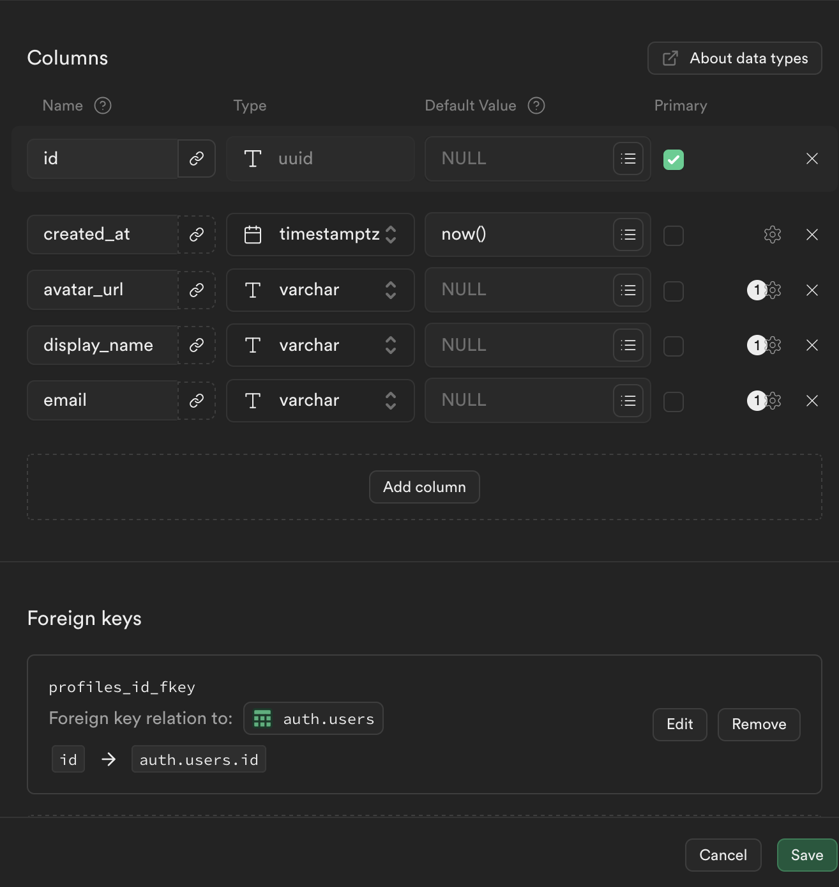
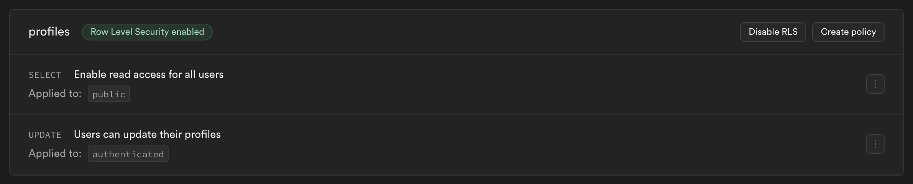
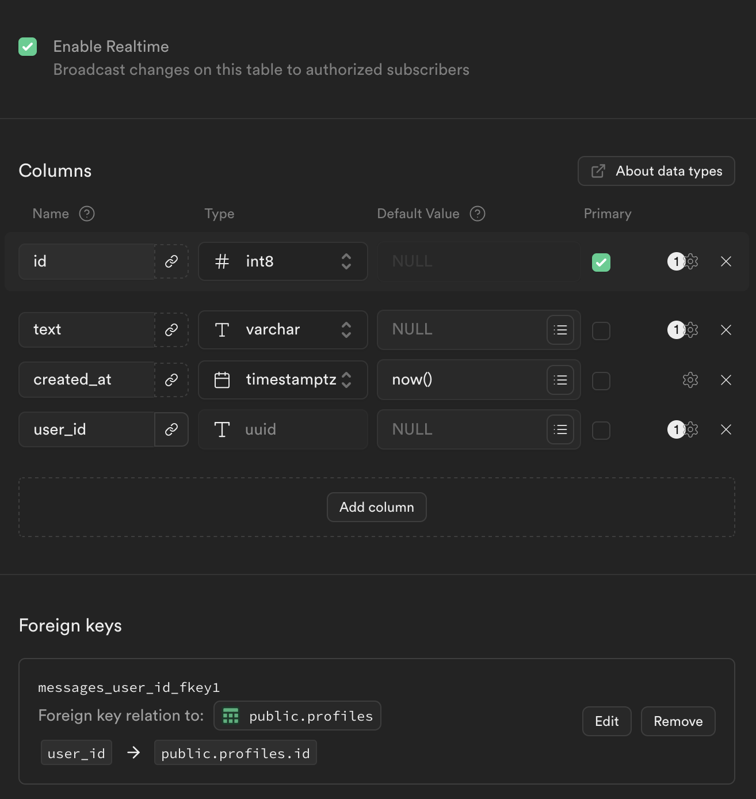
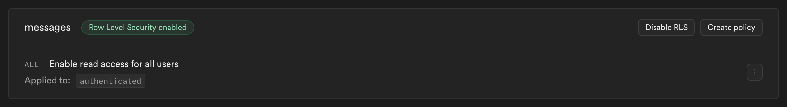

# Project Brief

The aim of this project is to a build a simple real time chat application using Nuxt 3 and Supabase with real time capabilities.

The project is build using Nuxt 3.12 which is the latest Nuxt 3 version. Some of the project dependencies include

-   Supabase for backend
-   Nuxt UI/TailwindCSS for styling
-   Typescript for type safety
-   ESLint, Prettier for ensuring code quality and formatting
-   Dayjs for date formatting
-   Yup for form validations

## Setup

After cloning this repo, cd into the directory by running

```
cd chat
```

Then proceed to install the dependencies:

```bash
yarn install
```

Start the development server on `http://localhost:3000`:

```bash
yarn dev
```

### Setup supabase locally

You can follow this [guide](https://supabase.com/docs/guides/cli/local-development) to install supabase locally on your machine. Docker desktop is also required to run this

#### Setup database

Profiles: This image is a representation of the schema for user profiles





Messages: This image is a representation of the schema for messages table





#### Create functions and triggers

Create a new supabase function called `create_user_profile()`

```sql
BEGIN
insert into public.profiles(id, avatar_url, displayName)
values (new.id, '', new.raw_user_meta_data ->> 'displayName');

return new;
END;
```

Create a new supabase trigger using the SQL editor to create user profiles upon user registeration

```sql
CREATE TRIGGER create_user_profile
AFTER INSERT ON auth.users
FOR EACH ROW
EXECUTE FUNCTION create_user_profile();
```

#### Start Supabase server

```bash
supabase start
```

#### Add environment variables

A `.env.example` file is already added specifying what values need to run the project succesfully. The first two keys are gotten after running the `supabase start` command while the `BEARER_TOKEN` can be any value of choice which will be used when calling the `/api/users` endpoint to fetch all users.
